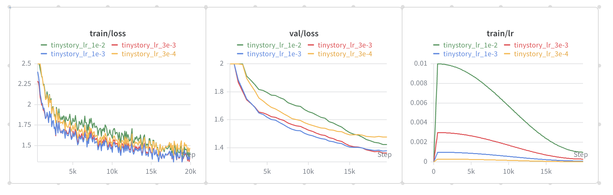
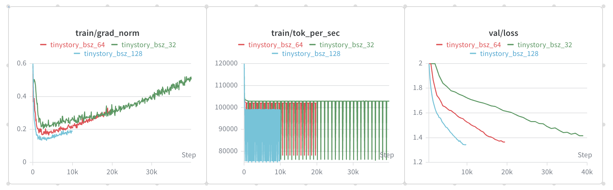
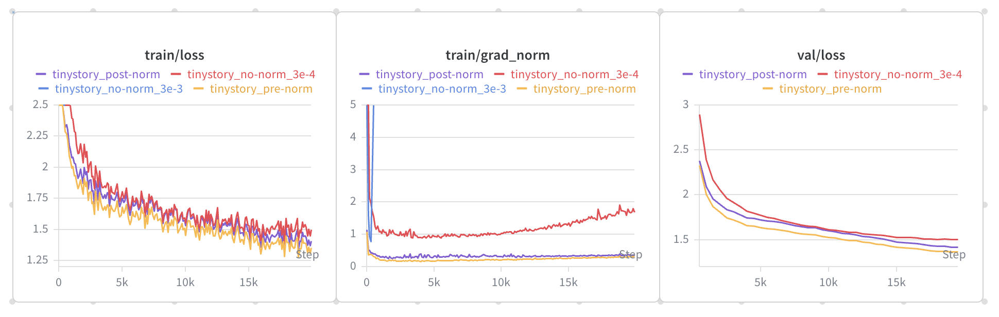

# archlab

A from-scratch LLM pretraining lab in PyTorch. Starts with a 22.7M-parameter 
dense Transformer baseline on TinyStories (val_loss = 1.344), with planned 
ablations on MoE and linear-attention architectures.

> 📚 Course version: CS336 Spring 2026  
> 📁 This repo covers: Lab 1 Basics


## Results

### LR Sweep 
**Setup**: 22.7M params, batch=64, context=256, 20k steps, ~328M tokens.

| LR | val_loss| PPL | |
| --- | --- | ---| --- |
| 3e-4 | 1.478 | 4.38 | ❌ |
| 1e-3 | 1.379 | 3.97 | ✅ |
| 3e-3 | 1.365 | 3.91 |🏅 best|
| 1e-2 | 1.424 | 4.15 |✅ |



**Search strategy**: half-decade grid scan around 3e-4. The U-shape across 
{3e-4, 1e-3, 3e-3, 1e-2} bounds the search interval; lr=3e-3 yields the lowest 
val_loss at step 20000.

### Batch Size Experiment 

**Setup**: Fixed token budget (~328M); total_iters scaled inversely with 
batch_size. LR=3e-3 held constant.

| batch_size | total_iters| warmup | val_loss | grad_norm | tok/s |
| --- | --- | ---| --- | --- | --- |
| 32 | 40000 | 1000 | 1.415 | 0.25| 100k 
| 64 | 20000 | 500 | 1.365 | 0.18 | 100k
| 128 | 10000 | 250 |🏅1.344| 0.13 | 100k




**Findings**:
1. **Gradient noise ∝ 1/√B**: grad_norm at bsz=32 is 1.9× that of bsz=128, 
   matching √(128/32)=2.0×.
2. **Throughput saturated at bsz=32**: ~100k tok/s across all bsz on RTX 4090; 
   compute saturation precedes memory limits at this model size.
3. **Larger batches → lower val_loss**: 1.415 → 1.365 → 1.344. Note: LR=3e-3 
   was tuned at bsz=64 (KR1); the bsz=128 advantage may be larger under 
   re-tuned LR (sqrt scaling suggests ~4.2e-3 for bsz=128).


### Layer Normalization
**Setup**: Three variants tested. RMSNorm removal (no-norm) was retried at 
a lower LR after divergence, per assignment instruction.

| Variant | LR| val_loss | 
| --- | --- |  --- | 
| no-norm | 3e-3 | 💥 NaN @ step 500 | 
| no-norm | 3e-4 | 1.505 | 
| post-norm | 3e-3 | 1.420 |
| pre-norm | 3e-3 | 🏅1.365 |



**Impact of RMSNorm**: At the optimal LR (3e-3), removing RMSNorm causes 
loss to explode to ~10⁸ within 500 steps. Stability is recoverable with 
lr=3e-4, but the 0.14 gap to baseline shows RMSNorm enables effective 
optimization at larger step sizes — not just numerical stability.

**Pre-norm vs post-norm**: Post-norm trains stably at lr=3e-3 with only a 
0.055 gap. Less dramatic than reports in deeper architectures (Xiong et al. 
2020) — the advantage of pre-norm is **depth-dependent**, consistent with 
the empirical shift from post-norm (Transformer 2017, BERT) to pre-norm 
(GPT/LLaMA) as model depth grew.

## Generation samples

Same prompt: `"Once upon a time, there was"`, temperature=0.8, top-p=0.9.

**lr=3e-4, val_loss=1.478** (under-trained baseline):
> Once upon a time, a little cat wanted to find his mom. Then,
he saw a big dog. The dog wanted to know what was behind the door. The cat was scared of the big dog.
The cat said, "Do not be scared. I will help you find your mom." The dog was happy. They walked together and found the big dog. The big dog was not scared anymore. He said, "Thank you, little cat. You are a good friend."
The moral of the story is to be brave and help others when they need it.


Coherent at the sentence level, but the dog's role is contradictory 
(scared the cat then needed help) and the story ends with a moralizing 
template common in under-trained TinyStories models.

**lr=3e-3, val_loss=1.365** (best LR):
> Once upon a time, a little cat wanted to find his mom. Then,
he saw a big dog. The dog had a collar. The cat said, "I can't find your mom!" The dog looked at the cat and said, "I can help you!"
The cat and the dog looked for the dog's mom. They walked and walked. They asked other animals if they saw her. No one said it was his mom. But then, they saw something unexpected. A big bird was in the tree! The cat and the dog were scared.
The cat said, "I'm sorry, I was just playing. I don't know where my mom is." The dog said, "It's okay, cat. I'm just playing." The cat, the dog, and the bird became friends. They found the cat's mom, and she was happy. The cat's mom said, "I missed you, cat. Thank you for helping me." The cat and the dog were not sad anymore. They were friends forever.

Longer narrative arc, multi-character interaction (cat + dog + bird), 
consistent goal tracking (finding mom), and natural resolution. 
A 0.11 val_loss difference translates to clearly improved coherence.


## Methodology Notes

- **All runs single-seed (seed=42)**. Gaps smaller than ~0.05 in val_loss 
  should be interpreted cautiously without multi-seed validation.
- **All comparisons under fixed token budget** (~328M tokens), not to 
  convergence. Rankings hold for this compute regime; absolute optima 
  under longer training may differ.
- **Iso-token, not iso-step**: KR2 scales total_iters inversely with 
  batch_size to maintain ~328M token budget across all runs.
  

## Quickstart

```bash
# 1. Setup
uv sync

# 2. Download data (TinyStories ~2GB)
mkdir -p data && cd data
wget https://huggingface.co/datasets/roneneldan/TinyStories/resolve/main/TinyStoriesV2-GPT4-train.txt
wget https://huggingface.co/datasets/roneneldan/TinyStories/resolve/main/TinyStoriesV2-GPT4-valid.txt
cd ..

# 3. Train tokenizer + tokenize (vocab=10000, compresses 2.06x → 540M tokens)
uv run archlab/trainer/train_tokenizer # ~2min
uv run prepare_data # ~26min

# 4. Train (uses best LR from sweep)
python -m archlab.script.pretrain --config archlab/configs/tinystory_lr_3e-3.yaml

# 5. Generate
python -m archlab.script.generate \
  --config archlab/configs/tinystory_lr_3e-3.yaml \
  --ckpt runs/tinystory_lr_3e-3/latest.pt \
  --prompt "Once upon a time, there was" \
  --temperature 0.8 --top-p 0.9
```

## Status

- [x] BPE tokenizer (vocab=10000, trained on TinyStories)
- [x] Transformer LM (RMSNorm, RoPE, SwiGLU, multi-head attention)
- [x] Training loop with checkpointing, resume, wandb integration
- [x] LR hyperparameter sweep (KR1, val_loss=1.366)
- [x] Batch size experiment (KR2, val_loss=1.344 @ bsz=128)
- [ ] MoE variant (8 experts, top-2)
- [ ] Linear attention ablation